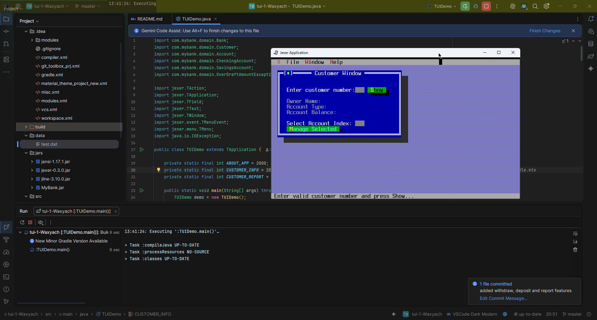

# UI Lab 1: Текстовий інтерфейс користувача (TUI) з використанням Jexer

Цей репозиторій містить виконання лабораторної роботи з розробки текстового інтерфейсу (TUI) для банківської системи за допомогою бібліотеки **Jexer**. Проєкт інтегровано з класами `Bank`, `Customer`, `Account` тощо.

---

## Реалізований функціонал

В ході роботи було повністю переписано базовий шаблон програми та реалізовано наступні завдання (рівень "на 5"):

1. **Динамічне завантаження даних:** Інформація про клієнтів та їхні рахунки автоматично зчитується з файлу `data/test.dat` за допомогою оновленого класу `DataSource`.
2. **Пошук та відображення клієнтів:** Реалізовано введення ID клієнта та виведення його імені, типу і балансу першого відкритого рахунку.
3. **Генерація звітів (Customer Report):** Додано нове вікно звіту, яке можна викликати через верхнє меню `File -> Customer Report`. Воно відображає повний список клієнтів та всі їхні рахунки.
4. **Управління рахунками (Транзакції):** * Додано можливість вибору конкретного рахунку клієнта за його індексом.
   * Реалізовано інтерактивні операції **Deposit** (внесення коштів) та **Withdraw** (зняття коштів) через діалогові вікна `TInputBox`.
   * Інтегровано обробку виключних ситуацій (`OverDraftAmountException`) для перевірки лімітів овердрафту та недостатньої кількості коштів.

---

## Скріншот роботи програми

Нижче продемонстровано роботу інтерфейсу додатку в режимі Swing-емуляції терміналу Jexer, де відкрито головне вікно клієнта, звіт та вікно управління рахунком:

